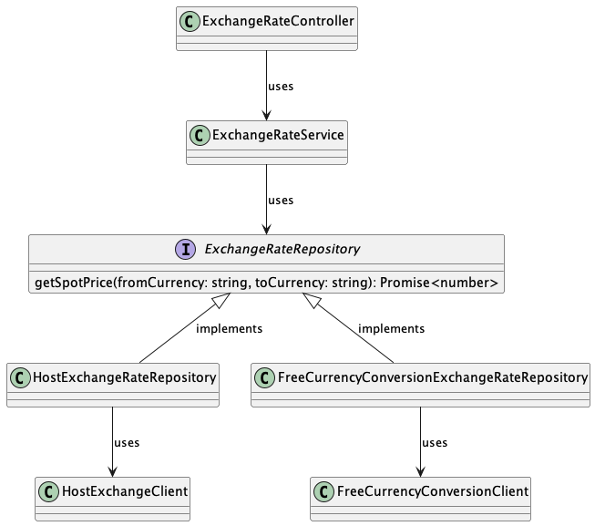
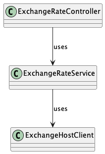
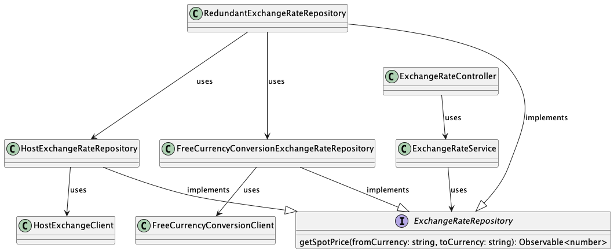

# Inversão de dependência no NestJS



## Instalando

```bash
yarn install
cp .env.example .env
```

Para utilizar todas as funcionalidades do aplicativo, é necessário possuir uma
chave de API para acessar o https://freecurrencyapi.com/. Conforme o nome
sugere, a utilização dessa ferramenta é gratuita.

Para se cadastrar, basta acessar https://app.freecurrencyapi.com/register e
preencher o formulário de cadastro. Após confirmar o e-mail, acesse o painel de
controle para obter a chave de API. Então, copie e cole o valor obtido na
variável de ambiente `FREE_CURRENCY_CONVERSION_API_KEY` que deverá ser definida
no arquivo `.env`.

## Rodando o projeto

```bash
yarn run start:dev
```

## Evolução

Nesta seção, abordaremos a evolução da solução inicial para uma abordagem mais
robusta, utilizando redundância entre as integrações.

O problema inicial era bastante simples, com apenas um serviço responsável por
isolar a lógica de negócio e realizar chamadas diretas ao cliente. No entanto,
nesse ponto, se desejarmos trocar a exchange rate, será necessário modificar o
serviço.



Após, surgiu a necessidade de integrar-se com outra exchange rate, o
que levou à introdução de um repositório para abstrair o conceito de "spot
price" na aplicação e evitar que o domínio dos clientes invada o domínio da
nossa aplicação. Dessa forma, esse repositório também atua como uma camada de

Sendo assim, o serviço é agora agnóstico a implementação do repositório o que
nos da liberdade de mudar o repositório sem afetar o serviço.

[anti-corrupção (anticorruption layer)](http://wiki.c2.com/?AnticorruptionLayer).


Finalmente, temos um exemplo do uso de redundância na integração com exchange
rates para aumentar a disponibilidade do nosso serviço. Desde a introdução da
inversão de dependência do repositório, o serviço nunca precisou ser alterado,
mesmo quando há a necessidade de trocar da Host Exchange Rate para a Free
Currency API ou uma combinação das duas.


